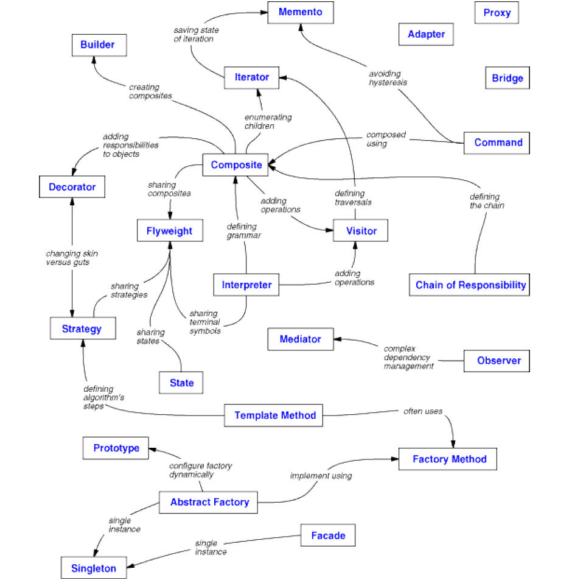
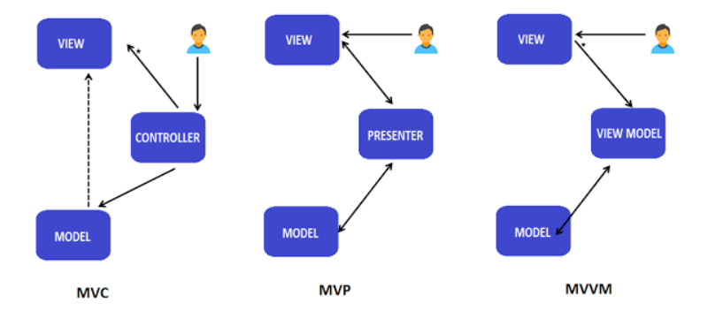

- [Introduction](#introduction)
  - [What is Design Pattern?](#what-is-design-pattern)
  - [Catalog](#catalog)
  - [Design Pattern Relationships](#design-pattern-relationships)
  - [OOPs](#oops)
  - [Inheritance vs Composition](#inheritance-vs-composition)
  - [Delegation](#delegation)
- [UX Design Patterns](#ux-design-patterns)
  - [MVC](#mvc)
  - [MVP](#mvp)
  - [MVVM](#mvvm)

# Introduction

-   Designing object-oriented software is hard, and designing **reusable** object-oriented software is even harder
-   Design patterns make it easier to reuse successful designs and architectures
-   Design patterns help us choose design alternatives that make a system reusable and avoid alternatives that compromise reusability

## What is Design Pattern?

-   Each pattern describes a problem which occurs over and over again in our environment, and then describes the core of the solution to that problem, in such a way that we can use this solution a million times over, without ever doing it the same way twice
-   **Four essential elements**:
    -   `Pattern Name`
    -   `Problem`: Describes when to apply the pattern
    -   `Solution`: Describes the element that makes up the design, their relationships, responsibilities, and collaborations
    -   `Consequences`: Results and trade-offs of applying the pattern which are critical for evaluating design alternatives and for understanding the costs and benefits of applying the pattern
-   Design patterns are descriptions of communicating objects and classes that are customized to solve a general design problem in a particular context

---

-   **Model/View/Controller**
    -   **Model**: Application object
    -   **View**: Screen presentation
    -   **Controller**: The way user interfaces reacts to the user input
-   Views and models establish a subscribe/notify protocol between them
-   **Observer** design pattern
-   Views can be nested, **Composite** design pattern
-   Encapsulates the response mechanism in a Controller object
-   View uses an instance of the Controller class, **Strategy** design pattern
-   MVC can also use
    -   **Factory Method** to specify the default controller class for a view
    -   **Decorator** to add scrolling to a view

## Catalog

<table>
    <thead>
        <tr>
            <th rowspan="2" colspan="2"></th>
            <th colspan="3">Purpose</th>
        </tr>
        <tr>
            <th>Creational</th>
            <th>Structural</th>
            <th>Behavioral</th>
        </tr>
    </thead>
    <tbody>
        <tr>
            <th rowspan="2">Scope</th>
            <th>Class</th>
            <td>Factory Method</td>
            <td>Adapter</td>
            <td>Interpreter Template Method</td>
        </tr>
        <tr>
            <th>Object</th>
            <td>Abstract Factory Builder Prototype Singleton</td>
            <td>Adapter Bridge Composite Decorator Facade Proxy</td>
            <td>Chain of Responsibility Command Iterator Mediator Memento Flyweight Observer State Strategy Visitor</td>
        </td>
    </tbody>
</table>

-   **Purpose** reflects what the pattern does
    -   **Creational** patterns concern the process of object creation
    -   **Structural** patterns deal with the composition of classes of objects
    -   **Behavioral** patterns characterize the ways in which classes or objects interact and distribute responsibility
-   **Scope** specifies whether the pattern applies to classes or objects
    -   **Class** patterns deal with relationship between classes and subclasses which are established through inheritance, so they are static and fixed at compile time
    -   **Object** patterns deal with object relationships, which can be changed at run-time and are more dynamic
-   Creational class patterns defer some part of object creation to subclasses, while Creational object patterns defer it to another object
-   The Structural class patterns use inheritance to compose classes, while the Structural object patterns describe ways to assemble objects
-   The Behavioral class patterns use inheritance to describe algorithms and flow of control, whereas the Behavioral object patterns describe how a group of objects cooperate to perform a task that no single object can carry out alone

## Design Pattern Relationships

## OOPs

-   Set of all signatures defined by an object's operations is called an **interface**
-   The run-time association of a request to an object and one of its operations is called **dynamic binding**
    -   Dynamic binding lets us substitute objects that have identical interfaces for each other at run-time. This substitutability is known as **polymorphism**
-   **Class** specifies the object's internal data and representation and defines the operations the object can perform
-   Objects are created by **instantiating** a class and the object is said to be an **instance** of a class
-   When a **subclass** inherits from a **parent class**, it includes the definitions of all the data and operations that the parent class defines
-   **Abstract** class is a one whose main purpose it to define a common interface for all its subclasses
    -   It will defer some or all of its implementations to operations defined in subclasses, hence it can't be instantiated
    -   Classes that aren't abstract are called **concrete** classes

## Inheritance vs Composition

-   Inheritance
    -   **Advantages**
        -   Defined at compile time and straightforward to use
        -   Easier to modify the implementation being reused
    -   **Disadvantages**
        -   Can't change implementations inherited from the parent class at run-time
        -   Parent classes often define at least part of their subclasses' physical representation i.e. implementation of the child class becomes so bound to the parent class
-   Composition
    -   **Advantages**
        -   Defined dynamically at run-time through objects acquiring references to other objects
        -   Requires object to respect each other's interfaces
        -   Don't break encapsulation
        -   Helps keep each class encapsulated and focus on one task
    -   **Disadvantages**
        -   Will have more objects created
-   **Second Principle of Object-oriented Design**: Favour object composition over class inheritance

## Delegation

-   Way of making composition as powerful for reuse as inheritance
-   Two objects are involved in handling a request: a receiving object delegates operations to its **delegate**
-   Design Patterns: **State**, **Strategy**, **Visitor**

# UX Design Patterns

## MVC

-   **Model**:
    -   Application object
    -   Data that is required to display in the view
    -   Represents a collection of classes that describes the business logic
-   **View**:
    -   Screen presentation
    -   UI Components
    -   View monitors the model for any state change and displays updated model
    -   They interact with each other using the **Observer** pattern
-   **Controller**:
    -   The way user interfaces reacts to the user input
    -   Responsible to process incoming requests
    -   Processes user's data through the Model and passing back the results to View
    -   Acts as a mediator b/w the View and the Model

## MVP

-   **View**:
    -   Directly interacts with user
    -   Doesn't contain any logic implemented
-   **Presenter**:
    -   Receives the input from users via View, then processes the user's data with the help of Model and passing the results back to the View
    -   Communicates with the View through interface which is defined in the Presenter
    -   The presenter manipulates the model and also updates the view
    -   View and Presenter are completely decoupled from each other and communicate to each other by an interface

## MVVM

-   **View-Model**
    -   Supports two-way data binding between View and View-Model
    -   This allows automatic propagation of changes, inside the state of View-Model to the View
    -   Generally, the View-Model utilizes the **Observer** pattern to inform changes in the View-Model to the Model
    -   It is responsible for exposing methods, commands, and other properties that help to maintain the state of the view, manipulate the model as the result of actions on the view, and trigger events in the view itself
    -   View has a reference to View-Model but View-Model has no information about the View
    -   There is many-to-one relationship between View and View-Model means many Views can be mapped to one View-Model
    -   The bi-directional data binding or the two way data binding between the view and the View-Model ensures that the models and properties in the View-Model is in sync with the view
    -
