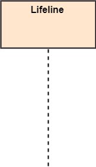
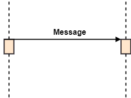
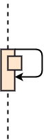
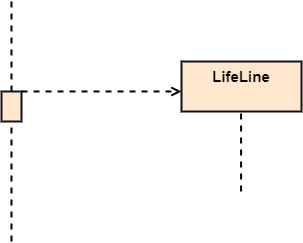
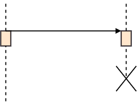

- [Unified Modelling Language](#unified-modelling-language)
- [Types of UML Diagram](#types-of-uml-diagram)
- [Activity Diagram](#activity-diagram)
  - [Notations](#notations)
- [Sequence Diagram](#sequence-diagram)
  - [Notations](#notations-1)
  - [Sequence Fragments](#sequence-fragments)
- [Class Diagram](#class-diagram)
  - [Representation](#representation)
  - [Relationship Types](#relationship-types)
    - [Inheritance (or Generalization)](#inheritance-or-generalization)
    - [Aggregation](#aggregation)
    - [Composition](#composition)
    - [Dependency](#dependency)
    - [Realization/Implementation](#realizationimplementation)
- [Component Diagram](#component-diagram)

# Unified Modelling Language

-   UML is a modern approach to modeling and documenting software
-   It has been used as a general-purpose modeling language in the field of software engineering
-   It is based on **diagrammatic representations** of software components
-   The main aim of UML is to define a standard way to visualize the way a system has been designed
-   It is quite similar to blueprints used in other fields of engineering
-   We use UML diagrams to portray the behavior and structure of a system

# Types of UML Diagram

-   **Behavioral UML Diagrams**:
    -   `Activity Diagram`
    -   `Sequence Diagram`
    -   `Use Case Diagram`
    -   `Interaction Overview Diagram`
    -   `Timing Diagram`
    -   `State Machine Diagram`
    -   `Communication Diagram`
-   **Structural UML Diagrams**:
    -   `Class Diagram`
    -   `Component Diagram`
    -   `Object Diagram`
    -   `Composite Structure Diagram`
    -   `Deployment Diagram`
    -   `Package Diagram`
    -   `Profile Diagram`

# Activity Diagram

-   Used for doing **business process modelling**
-   It is generally used to describe the flow of different activities and actions
-   These can be both sequential and in parallel
-   They describe the objects used, consumed or produced by an activity and the relationship between the different activities
-   Main focus is the flow of activities


## Notations


# Sequence Diagram

-   It describe the sequence of messages and interactions that happen between objects
-   Main focus is the interaction between objects over a specific period of time
-   All communication is represented in a chronological manner

## Notations

-   **Lifeline**:

    -   An individual participant in the sequence diagram is represented by a lifeline
    -   It is positioned at the top of the diagram\
        

-   **Actor**:

    -   A role played by an entity that interacts with the subject is called as an actor
    -   It is out of the scope of the system
    -   It represents the role, which involves human users and external hardware or subjects\
        

-   **Activation**:

    -   It is represented by a thin rectangle on the lifeline
    -   It describes that time period in which an operation is performed by an element, such that the top and the bottom of the rectangle is associated with the initiation and the completion time, each respectively\
        

-   **Messages**:
    -   The messages depict the interaction between the objects and are represented by arrows
    -   They are in the sequential order on the lifeline
    -   **Call Message**: It defines a particular communication between the lifelines of an interaction, which represents that the target lifeline has invoked an operation
        -   **Synchronous Message**: Solid Arrow\
            
        -   **Asynchronous Message**: Line Arrow\
            
    -   **Return Message**: It defines a particular communication between the lifelines of interaction that represent the flow of information from the receiver of the corresponding caller message\
        
    -   **Self Message**: It describes a communication, particularly between the lifelines of an interaction that represents a message of the same lifeline, has been invoked\
        
    -   **Recursive Message**: A self message sent for recursive purpose is called a recursive message\
        
    -   **Create Message**: It describes a communication, particularly between the lifelines of an interaction describing that the target (lifeline) has been instantiated\
        
    -   **Destroy Message**: It describes a communication, particularly between the lifelines of an interaction that depicts a request to destroy the lifecycle of the target\
        
    -   **Duration Message**: It describes a communication particularly between the lifelines of an interaction, which portrays the time passage of the message while modeling a system\
        


## Sequence Fragments


| Operator   | Fragment Type                                                                                                                                                                                  |
| ---------- | ---------------------------------------------------------------------------------------------------------------------------------------------------------------------------------------------- |
| `alt`      | Alternative multiple fragments: The only fragment for which the condition is true, will execute.                                                                                               |
| `opt`      | Optional: If the supplied condition is true, only then the fragments will execute. It is similar to alt with only one trace.                                                                   |
| `par`      | Parallel: Parallel executes fragments.                                                                                                                                                         |
| `loop`     | Loop: Fragments are run multiple times, and the basis of interaction is shown by the guard.                                                                                                    |
| `critical` | Critical region: Only one thread can execute a fragment at once.                                                                                                                               |
| `neg`      | Negative: A worthless communication is shown by the fragment.                                                                                                                                  |
| `ref`      | Reference: An interaction portrayed in another diagram. In this, a frame is drawn so as to cover the lifelines involved in the communication. The parameter and return value can be explained. |
| `sd`       | Sequence Diagram: It is used to surround the whole sequence diagram.                                                                                                                           |


# Class Diagram

-   Contains classes/interfaces, alongside their fields and methods and the relationship between the classes

## Representation

-   **Interface class**: `<<interface>>`
-   **Abstract Class**: `<<abstract>>`
-   **Service Class**: `<<service>>`
-   **Enum**: `<<enumeration>>`

<br/>

-   `+` **Public**
-   `-` **Private**
-   `@` **Protected**
-   `~` **Package/Internal**

<br/>

-   **Abstract Method**: `method()*`
-   **Static Method**: `method()$`
-   **Static Field**: `<type> field$`


## Relationship Types

### Inheritance (or Generalization)


```cs
public class A {}

public class B : A {}
```

-   Represents an **is-a** relationship
-   An abstract class name is shown in italics
-   SubClass1 and SubClass2 are specializations of Super Class
-   A solid line with a hollow arrowhead that point from the child to the parent class

### Aggregation


```cs
public class A {
    B b;
    public void setB(B b_ref) {
        this.b = b_ref;
    }
}
// Even if we delete class A, object of class B
// will still exist as it comes from outside
```

-   Special type of **association** to model **whole to its parts** relationship
-   Class2 is part of class1 i.e. **it is contained/stored inside some field**
-   Many instances of Class2 can be associated with Class1
-   Objects of Class1 and Class2 have separate lifetimes
-   A solid line with an unfilled diamond at the association end connected to the class of composite

### Composition


```cs
public class A {
    B b;
    public void setB() {
        this.b = new B();
    }
}
// If we delete class A, B wont exist
```

-   Special type of aggregation where parts are destroyed when the whole is destroyed
-   Objects of Class2 live and die with Class1
-   Class2 cannot stand by itself
-   A solid line with a filled diamond at the association connected to the class of composite

### Dependency


```cs
public class A {
    public void useB(B b_ref) {
        // ...
        int res = b_ref.method();
        // ...
    }
}
```

-   Exists between two classes if the changes to the definition of one may cause changes to the other (but not the other way around)
-   Class1 depends on Class2
-   **Object is not contained/stored in any field**, it could be a parameter in a method or could be used inside a method
-   A dashed line with an open arrow

### Realization/Implementation


```cs
interface A {}

public class B : A {}
```

-   One model element (the client) realizes (implements or executes) the behavior that the other model element (the supplier) specifies
-   Class1 implements Interface1
-   A broken line with an unfilled solid arrowhead is drawn from the class that defines the functionality of the class that implements the function

# Component Diagram

-   Also known as **Module Diagram**
-   It can help break down the system into smaller components
-   It shows the relationship b/w different components in a system
-   **No Cyclic Dependency**
-   **Lower level modules may not depend on upper level modules**
-   The term **component** refers to a module of classes that represent independent systems or subsystems with the ability to interface with the rest of the system


